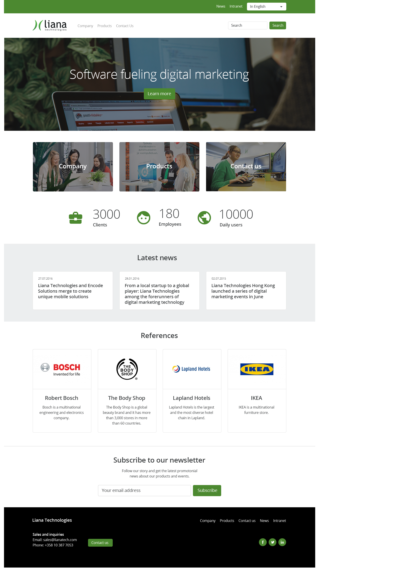

# Getting Started with landingpage
When I applied to Liana Technologies for internship role, I was given an entry task to create a website according to their Figma design. Using the given Figma design, this redesigned landing page for Liana Technologies was created.

- **Github link** - [https://github.com/jirimicvl/landingpage](https://github.com/jeresulovuo/landingpage_liana_tech)
- **Project deployed** via <a href="https://lianatechnologylandingpage.vercel.app/">vercel</a> - https://lianatechnologylandingpage.vercel.app/

# Feedback from Liana Technologies
> The task was implemented according requirements and also the extra's were implement. We asked to focus on and show off HTML and CSS skills, frameworks like React/Vue/Angular were not allowed. Jere was not afraid to be creative and even extended the assignment with his own implementation, which he did very well and thus he exceeded our expectations.

#### **Tools & Technologies** used:
, , , , 

## How to start this project
#### 1. git clone https://github.com/jirimicvl/landingpage.git
#### 2. cd landingpage
#### 3. open index.html 

## Technologies added:
- email input filter => filters input that aren't email syntax. If correct email is given, input bar turns green with envy.
- ~subscribe button / modal => if input passes email filter, it opens modal menu and thanks user for registering.~ [Updated]
- subscribe button / sweetalert modal => if input passes email filter, it opens sweet alert modal menu and thanks user for registering.
- animated numbers - Statistics number of company increments over time.
- feed rss mapping via feednami.
- Mobile responsiveness.
- Parallax effect Main Image using "Latest News" section.

## Challenges faced
- latest news section data stopped mapping while parallax data in the header is mapping.
- Unexpected changes to CSS styling.
- Parallex effect.
- Header Images Alignment.
- Reverse parallex.

